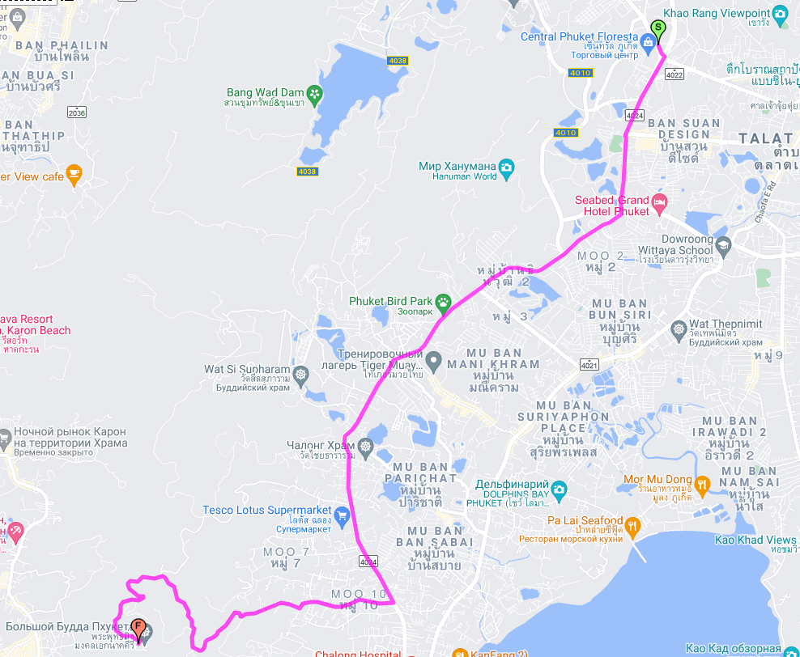
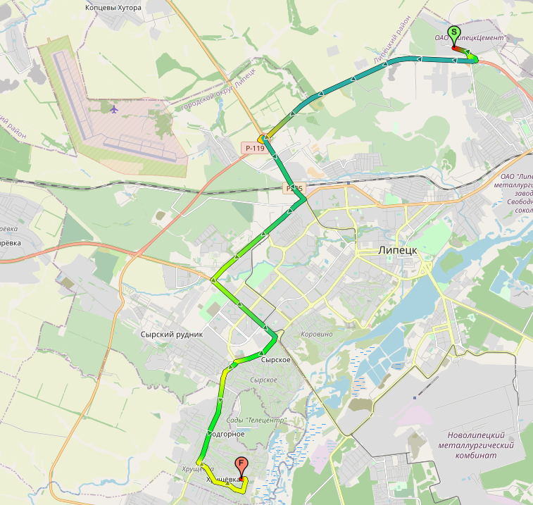
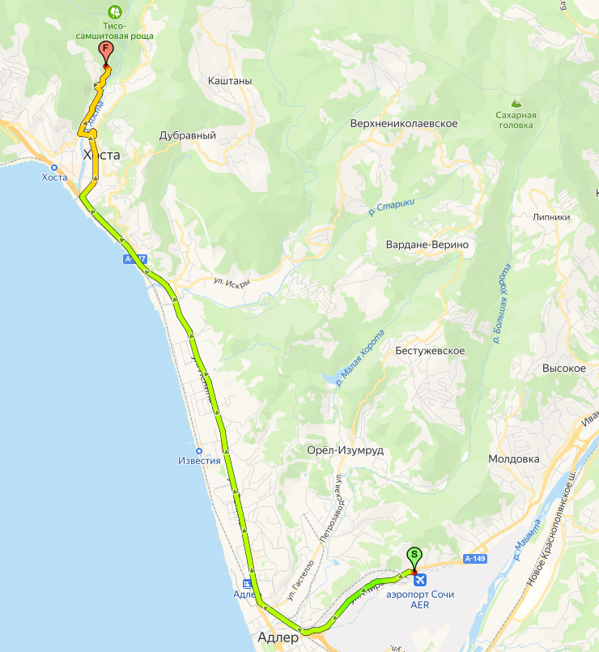
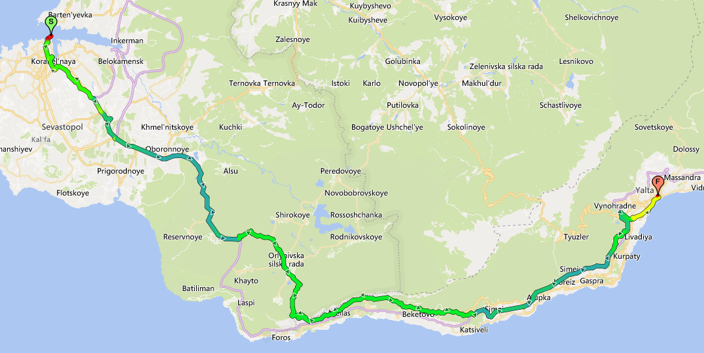
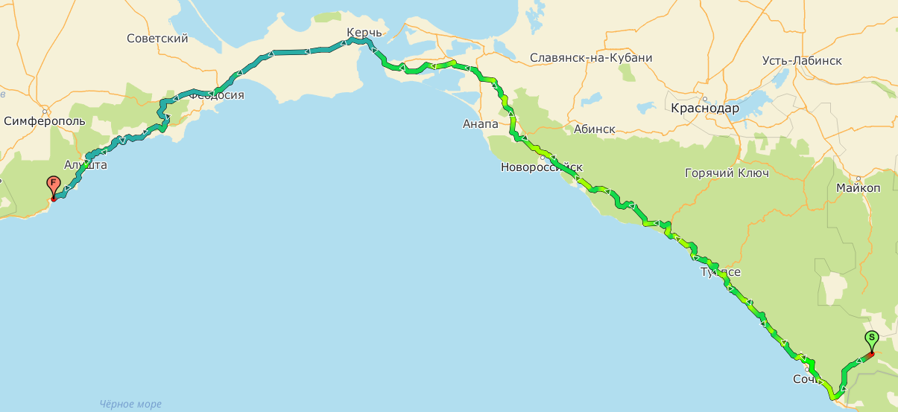
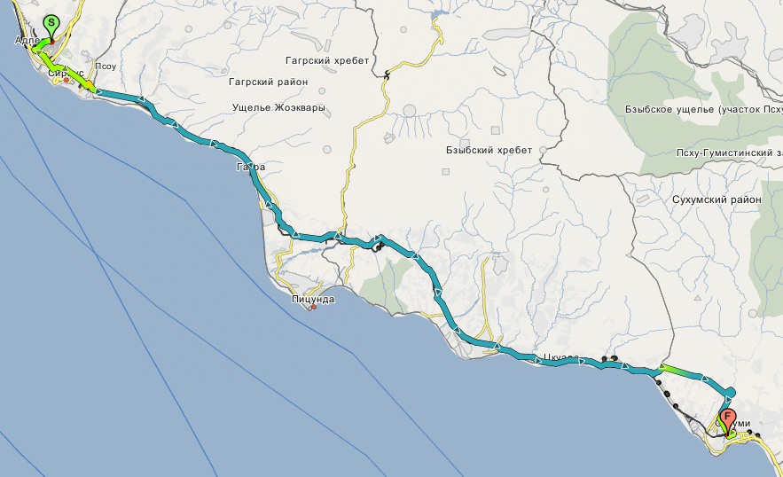
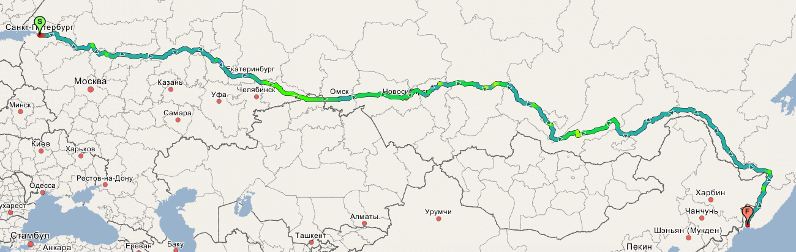
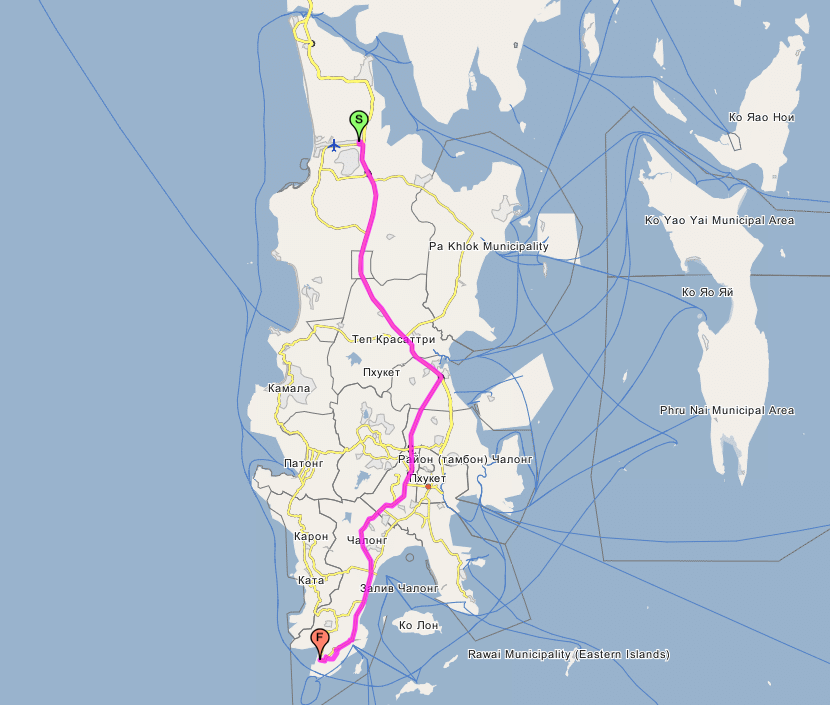

# dkxce Route Engine

dkxce.Route.Engine with TCP and HTTP support for Road Maps by Garmin or OSM source data   
Маршрутный движок для карт Garmin или OSM с подключением через TCP и HTTP   
Works with [OSM2SHP](https://github.com/dkxce/OSM2SHP) data    
Работает с данными, полученными с [OSM2SHP](https://github.com/dkxce/OSM2SHP)    

--

- Source Data: Shapes (in WGS-84) and DBF files   
- Support: Gamin Shapes (in WGS-84) Format   
- Support: OSM Shapes (in WGS-84) Format from [OSM2SHP Converter](https://github.com/dkxce/OSM2SHP)   
- Support: Water ways (for marine navigation)
- Support: Turn Restrictions (FL Format)   
- Support: Line Splitting by Nodes Shape File   
- Support: External Turn Restrictions DBF File   
- Support: Garmin Road Type   
- Support: OSM Highway, Service, Surface, Lanes, Practical Max Speed   
- Support: Road Attributes: MaxWeight, MaxAxle, MaxHeight, MaxWidth, MaxLength, MinDistance   
- Support: Restrictions: Tunnel, Bridge, Ferry, Toll, Customs, Tow, Railway and other   
- Support: TCP and HTTP (REST) protocol    
- Support: Road Traffic (JAMs) as external service    
- HTTP Web: API, Status and test map  
- Web API: REST, SOAP, XML-RPC    
- nmsRoutesDirectCall.dll for C# and ActiveX   
- Testing applications   
- Converter from shapes   
- Route Engine as Service   
- Any graph data (not only roads)   

--

- Поддерживает источники данных в виде shape фалов и dbf файлов    
- Поддерживает: GARMIN shape файлы   
- Поддерживает: OSM shape файлы из [OSM2SHP Converter](https://github.com/dkxce/OSM2SHP)    
- Поддерживает: Водные пути (для морских и речных маршрутов)
- Поддерживает: Запреты поворотов (FL формат)
- Поддерживает: Деление полилиний на составляющие (по узлам)    
- Поддерживает: Внешний DBF файл запретов поворотов (FL)   
- Поддерживает: Тип дорог GARMIN    
- Поддерживает: OSM Highway, Service, Surface, Lanes, Practical Max Speed   
- Поддерживает: Атрибуты дорог: ограничения высоты, массы, нагрузки на ось, ширины, длины, дистанции
- Поддерживает: Запреты: движение через жилые зоны, по грунтовыи дорогам, тоннели, мосты, паромы, железнодорожные переезды, атомагистрали, платные дороги, на грузовом транспорте, с прицепом, таможня, опасный груз и т.д.    
- Поддерживает: TCP и HTTP (REST) подключения   
- Поддерживает: Трафик (пробки) как внешний подключаемый сервис   
- Веб сервер: API, статус и тестовая карта   
- Веб API: REST, SOAP, XML-RPC    
- nmsRoutesDirectCall.dll для C# и ActiveX   
- Приложения для тестирования   
- Конвертер из shape файлов
- Маршрутный движок как сервис   
- Любой граф данных (не только дороги)   

--

    
    
    
    
    
    
    
    